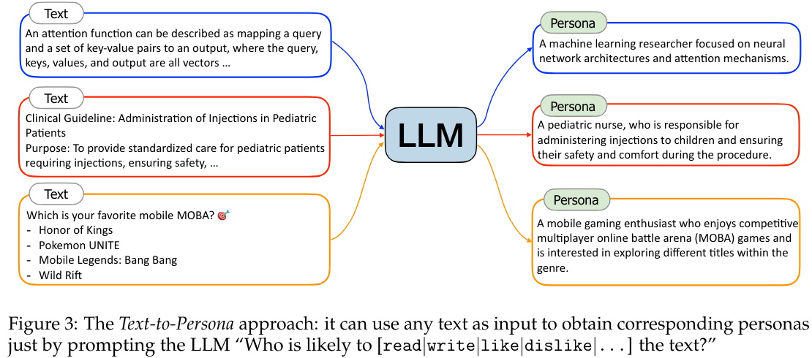
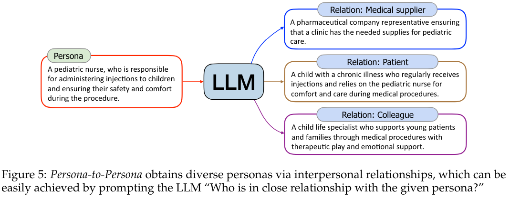
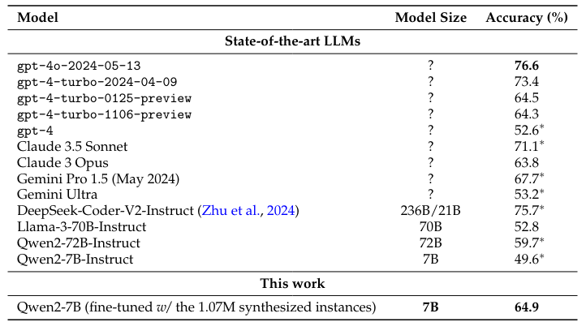
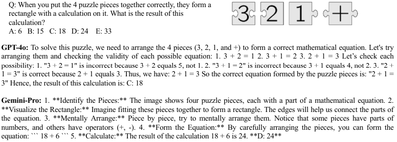
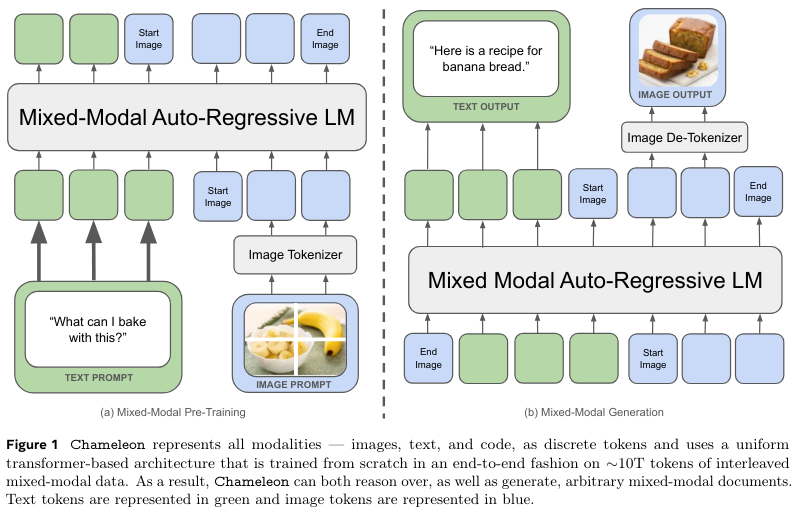
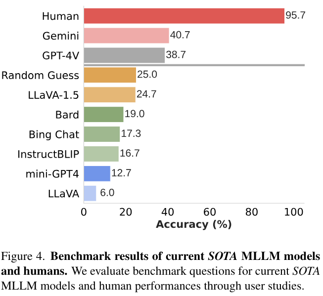
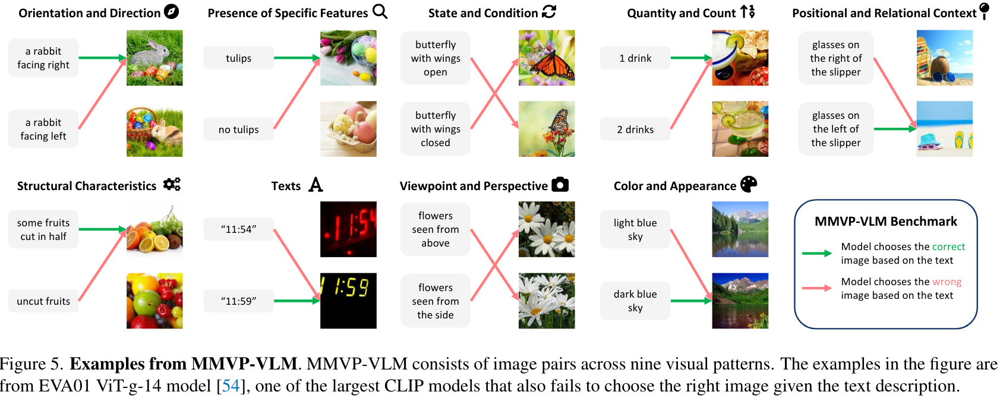

### Scaling Synthetic Data Creation with 1,000,000,000 Personas

```yaml
Author: Xin Chan, Xiaoyang Wang, Dian Yu, Haitao Mi, Dong Yu
Org: Tencent AI Lab Seattle
Date: 2024-06
```

github: [https://github.com/tencent-ailab/persona-hub](https://github.com/tencent-ailab/persona-hub)

- **Problématique:**  It is non-trivial to create *synthetic data* at scale: while we can easily scale up the quantity of synthetic data, it is difficult to ensure its diversity scales up as well. 

- **Old methods:** Instance-driven, Key-point-driven. **New:** persona-driven

- **Build Persona**

  - Test to Persona (based on *RedPajama v2 dataset*)

  <figure>
      
      <figcaption>Source: https://arxiv.org/pdf/2406.20094#page=5<figcaption>
  <figure>

  - Persona to Persona

    <figure>
        <figcaption>source: https://arxiv.org/pdf/2406.20094#page=5</figcaption>
    </figure>

  - **Deduplication :** MinHash & Embedding based

- Evaluation: 

  1. Synthetic Test Set 
  2. MATH(Out of distribution), a benchmark for testing math reasoning ability of LLMs.

  <figure>
      
      <figcaption>Source: https://arxiv.org/pdf/2406.20094#page=9</figcaption>
  </figure>
  
  

---

### Download ChatGPT

https://openai.com/chatgpt/download/

---

### ESM3: Simulating 500 million years of evolution with a language model

https://www.evolutionaryscale.ai/blog/esm3-release

**ESM: Earth System Modelling** ESM3 takes a step towards the future where AI is a tool to engineer biology from first principles in the same way we engineer structures, machines and microchips, and write computer programs.

---

### Evaluating Large Vision-and-Language Models on Children’s Mathematical Olympiads

```yaml
Author: Anoop Cherian, Kuan-Chuan Peng, Suhas Lohit, Joanna Matthiesen, Kevin Smith, Joshua B. Tenenbaum
Org: Mitsubishi Electric Research Labs, Cambridge, MA, Math Kangaroo USA NFP
Massachusetts Institute of Technology, Cambribdge, MA
Date: 2024-06
```

-  **Selected Large Vision-and-Language Models** : GPT-4o, Gemini-Pro, and Claude-3 Opus

- **SMART-840 dataset** 

  <figure>
      
      <figcaption><strong>A 3rd grader puzzle from our SMART-840 dataset and the LVLM responses (both incorrect)</strong> <br> Source: https://arxiv.org/pdf/2406.15736#page=3</figcaption>
  </figure>

---

### Language-based AI Agents and Large Action Models (LAMs)

tutorial link: https://pan.baidu.com/s/1NDbAfmoFx3LZULH3jgR2rQ

---


### AI et Meta: Four new publicly available AI models

#### **Meta Chameleon** [github](https://github.com/facebookresearch/chameleon),  [arxiv](https://arxiv.org/pdf/2405.09818)

>We present Chameleon, a family of early-fusion token-based mixed-modal models capable of understanding and generating images and text in any arbitrary sequence.
>
>-- Chameleon Team



**Image Tokenization** We train a new image tokenizer based on Gafni et al. (2022)[^1], which encodes a 512 × 512 image into 1024 discrete tokens from a codebook of size 8192. 

**Tokenizer ** new BPE tokenizer, with a vocabulary size of 65,536, which includes the 8192 image codebook tokens, using the sentencepiece library 

**Architecture**  largely follows LLaMa-2. For normalization, we continue to use `RMSNorm` , we use the `SwiGLU` activation function and `rotary positional embeddings` (RoPE).[^2]

**Chameleon** learns to jointly reason over image and text in a way that is impossible with late-fusion architectures or models that maintain <span style="background:yellow">separate encoders for each modality</span>.


#### Meta Multi-Token Prediction [arxiv](https://arxiv.org/pdf/2404.19737) , 

#### Meta JASCO

- text-to-music

#### Meta AudioSeal

 AudioSeal makes it possible to pinpoint AI-generated segments within a longer audio snippet. 

---

### Papers

- [Autoregressive Image Generation without Vector Quantization](https://arxiv.org/pdf/2406.11838)
- [Scaling the Codebook Size of VQGAN to 100,000 with a Utilization Rate of 99%](https://arxiv.org/pdf/2406.11837)
- [Unveiling Encoder-Free Vision-Language Models](https://arxiv.org/pdf/2406.11832)
- [MMDU: A Multi-Turn Multi-Image Dialog Understanding Benchmark and Instruction-Tuning Dataset for LVLMs](https://arxiv.org/pdf/2406.11833)
- [DocGenome: An Open Large-scale Scientific Document Benchmark for Training and Testing Multi-modal Large Language Models](https://arxiv.org/pdf/2406.11633)
- [Seeing Clearly, Answering Incorrectly: A Multimodal Robustness Benchmark for Evaluating MLLMs on Leading Questions](https://arxiv.org/pdf/2406.10638)
- [From Pixels to Prose: A Large Dataset of Dense Image Captions](https://arxiv.org/pdf/2406.10328)

---

### Does AI need a stronger visual foundation to achieve understanding and meaning?

[Eyes Wide Shut? Exploring the Visual Shortcomings of Multimodal LLMs](https://arxiv.org/pdf/2401.06209)

**Peripatetic axiom**

>Nothing is in the intellect that was not first in the senses 
>
>*Nihil est in intellectu quod non sit prius in sensu* -- [Thomas Aquinas](https://en.wikipedia.org/wiki/Thomas_Aquinas)

**Do humans require sensory grounding for meaning and understanding ?**  [^3]

<figure>
    
    <figcaption>Source: https://arxiv.org/pdf/2401.06209#page=4</figcaption>
</figure>

**9 visual patterns -- type of errors MMVP-VLM make**

<figure>
    
    <figcaption>Source: https://arxiv.org/pdf/2401.06209#page=5</figcaption>
</figure>


---

### A Comprehensive Survey of Scientific Large Language Models and Their Applications in Scientific Discovery

https://arxiv.org/pdf/2406.10833

:construction:

---

# V-*IRL*: Grounding Virtual Intelligence in Real Life

https://virl-platform.github.io/


---


[^1]: [Make-A-Scene: Scene-Based Text-to-Image Generation with Human Priors](https://arxiv.org/pdf/2203.13131)
[^2]: [大语言模型结构之：旋转位置编码RoPE - 魔法学院的Chilia的文章 - 知乎](https://zhuanlan.zhihu.com/p/670118670)
[^3]: [智源独家丨谢赛宁：AI是否需要更强的视觉基础来实现理解和意义?](https://mp.weixin.qq.com/s/EM1DPmB3VF-El30Rxudd8g)


