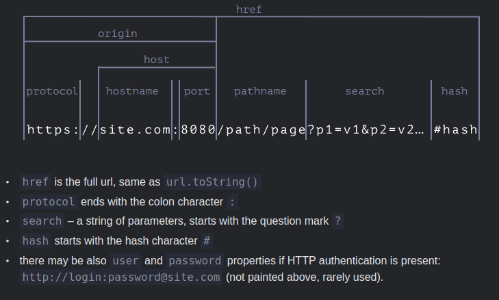

## Javascript

https://github.com/Asabeneh/30-Days-Of-JavaScript

### Data Types

```javascript
let numOne = 3
let numTwo = 3
console.log(numOne == numTwo)      // true
let js = 'JavaScript'
let py = 'Python'
console.log(js == py)             //false 
let lightOn = true
let lightOff = false
console.log(lightOn == lightOff) // false
```


## Server

https://javascript.info/url




## Some QA

### **readFile vs readFileSync**[^4]

**readFile() and the fs. readFileSync() method. The first method will read the file content in a non-blocking asynchronous manner and return the content in a callback function. **The readFileSync() method, on the other hand, will read the file synchronously i.e, code executions are blocked until this process is completed.


### Difference between `<button type="submit">` and `<input type="submit">`[^5]

The difference is that `<button>` can have content, whereas `<input>` cannot (it is a null element). While the button-text of an `<input>` can be specified, you cannot add markup to the text or insert a picture. So `<button>` has a wider array of display options.


## Gunicorn

>WSGI: Web Server Gateway Interface
>
>[梳理Python WSGI与WSGI服务器等概念 ](https://fantasyhh.github.io/2019/06/27/python3-wsgi-concept/)

### Worker classes

`gunicorn --worker-class XXXXXXXXXX`

- sync

- eventlet: [Eventlet](https://eventlet.net/) can be used, which is a non-blocking I/O based library that also uses coroutines for asynchronous work.

- aiohttp

- gthread

- uvicorn: for fastapi

  


**gunicorn.conf.py**

https://docs.gunicorn.org/en/latest/index.html

```python
# RTFM -> http://docs.gunicorn.org/en/latest/settings.html#settings
import os

bind = '0.0.0.0:9999'
workers = 2
timeout = 1000
# max_requests = 2000
# max_requests_jitter = 500
 
 
def on_starting(server):
    """
    Attach a set of IDs that can be temporarily re-used.
    Used on reloads when each worker exists twice.
    """
    server._worker_id_overload = set()
 
 
def nworkers_changed(server, new_value, old_value):
    """
    Gets called on startup too.
    Set the current number of workers.  Required if we raise the worker count
    temporarily using TTIN because server.cfg.workers won't be updated and if
    one of those workers dies, we wouldn't know the ids go that far.
    """
    server._worker_id_current_workers = new_value
 
 
def _next_worker_id(server):
    """
    If there are IDs open for re-use, take one.  Else look for a free one.
    """
    if server._worker_id_overload:
        return server._worker_id_overload.pop()
 
    in_use = set(w._worker_id for w in server.WORKERS.values() if w.alive)
    free = set(range(1, server._worker_id_current_workers + 1)) - in_use
 
    return free.pop()
 
 
def on_reload(server):
    """
    Add a full set of ids into overload so it can be re-used once.
    """
    server._worker_id_overload = set(range(1, server.cfg.workers + 1))
 
 
def pre_fork(server, worker):
    """
    Attach the next free worker_id before forking off.
    """
    worker._worker_id = _next_worker_id(server)
 
 
def post_fork(server, worker):
    """
    Put the worker_id into an env variable for further use within the app.
    """
    os.environ["APP_WORKER_ID"] = str(worker._worker_id)

```


### FastAPI


## Reference

[^1]: [Difference between Display:none and visibility:hidden](https://www.linkedin.com/pulse/difference-between-displaynone-visibilityhidden-aman-varshney/)
[^2]:  https://www.w3schools.com/css/tryit.asp?filename=trycss_display
[^3]: [AJAX - The XMLHttpRequest Object](https://www.w3schools.com/js/js_ajax_http.asp)
[^4]: https://www.memberstack.com/blog/reading-files-in-node-js
[^5]: https://html.com/attributes/button-type/#ixzz8XkG11tMR